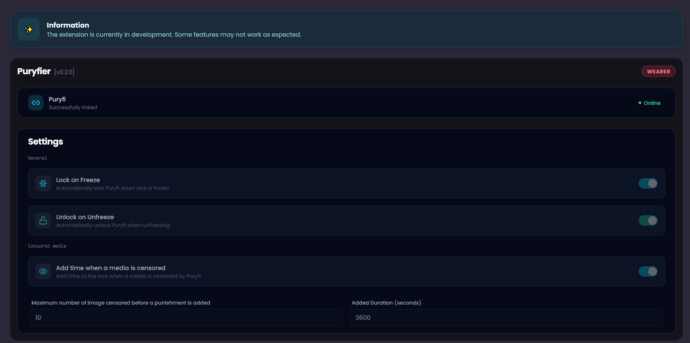

<p align="center">
  
  <br><b>🌙 Puryfier</b>
</p>

**Puryfier** is a Chaster extension that link [Pury.fi](https://pury.fi/) with [Chaster.app](https://chaster.app/) to provide more fun to your chastity locks and self lock.

## ✨ Key Features

- ❄️ Lock & Enable Puryfi when your lock is frozen.
- 🔓 Unlock & Disable Puryfi when your lock is unfrozen.
- 📸 Add time when media is censored by Puryfi.

## 🚀 Goals

Censorship is fun, even more when involving other things such as Chastity, Denial and more.. Puryfier is something made to help you to have fun with these.

## 📖 Requirements

- Puryfi 0.8.6.0 or higher (https://pury.fi)
- Docker (https://docs.docker.com/get-started/get-docker/)
- Chaster API Access & a Chaster Extension (https://chaster.app/developers/applications)
- A way to expose the backend to Internet to receive Chaster webhooks (e.g. Cloudflare tunnel, ngrok...)

## 🌟 Run

**⚠ Fill the `.env` file before running using docker compose.**

```bash
git clone https://github.com/httxSereti/puryfier.git
cd puryfier
cp .env.example .env
docker compose up -d
```

## ❓ How to use

1. Copy .env.example as .env and fill it.
2. Run using Docker `docker compose up -d`
3. Create a Chaster extension with these URLs.
```
Main page URL: <frontend-url>/extension/main
Configuration page URL: <frontend-url>/extension/configuration
Webhook URL: <backend-url>/api/webhooks/extensions/chaster
```
4. Create a Lock or Self-Lock with this extension.
5. Go to the extension in the lock settings page.
6. Link Chaster and Puryfi.
7. Enjoy!

## 🤝 How to Contribute / Contact Us

I've made a discord server to centralize information, suggestions, bugs and more.
You can join it [here](https://discord.gg/vD8zyyMXne)

* 🌍 [Website](https://paa.ge/sereti)
* ✉️ [Email](mailto:httxsereti@gmail.com)
* 💜 [Discord](https://discord.com/users/939288874281222225)